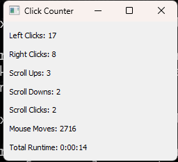

# mouse clickz

mouse.clickz is a python program that tracks and counts mouse clicks, scrolls, and movements that can be minimzed to tray. It provides a graphical user interface that displays the current click counts and allows users to view their mouse activity. The program also saves the click counts to a JSON file every hour and when the program is closed.

A simple python program that tracks and counts mouse clicks, scrolls, and movements.

# Features:
Tracks and counts mouse clicks, scrolls, and movements

Displays current click counts in a graphical user interface

Saves click counts to a counter file every hour and when the program is closed

Provides a system tray icon for easy access to the program

# Requirements:

Python 3.x

PyQt5

pynput

# Running it:

Clone the repository using git clone https://github.com/alby13/mouse-clickz.git
Install the required packages using pip install -r requirements.txt
Run the program using python mouse_clickz.py

I recommend running it in Command Prompt. This program was designed for Windows 11, but should work on anything.
If you would like to run the program without Command Prompt showing and when you close the program from the window it minimizes to the task bar icons you can create a batch (.bat) file with the following and double click it to launch:

<code>@echo off
cd /d "%~dp0"
start "" pythonw click_counter.py</code>

Windows version closes to hidden taskbar icons and then right clicking on the program there can close it.
Linux Version has this function removed to allow it to close like normal, closing the window.

# Usage:

Run the program and click on the system tray icon to view the current click counts
Click on the "Show" button to view the graphical user interface
Click on the "Hide" button to hide the graphical user interface
Click on the "Quit" button to close the program and save the click counts

# License:

PyQt5:

License: GPL v3 (General Public License version 3)
License Text: GPL v3 License Text
Permissive: No
Commercial Use: Yes, but with restrictions
Distribution: Yes, but with restrictions
Note: The GPL v3 license requires that any modifications to the code be made available under the same license, and that the original copyright notice be preserved.

pynput:

License: MIT License
License Text: MIT License Text
Permissive: Yes
Commercial Use: Yes
Distribution: Yes
Note: The MIT License is a permissive license that allows for free use, modification, and distribution of the software.

THE SOFTWARE IS PROVIDED “AS IS”, WITHOUT WARRANTY OF ANY KIND, EXPRESS OR IMPLIED, INCLUDING BUT NOT LIMITED TO THE WARRANTIES OF MERCHANTABILITY, FITNESS FOR A PARTICULAR PURPOSE AND NONINFRINGEMENT. IN NO EVENT SHALL THE AUTHORS OR COPYRIGHT HOLDERS BE LIABLE FOR ANY CLAIM, DAMAGES OR OTHER LIABILITY, WHETHER IN AN ACTION OF CONTRACT, TORT OR OTHERWISE, ARISING FROM, OUT OF OR IN CONNECTION WITH THE SOFTWARE OR THE USE OR OTHER DEALINGS IN THE SOFTWARE.

Author:
alby13

Version:
there's a version?
i am providing a complete and tested working program
